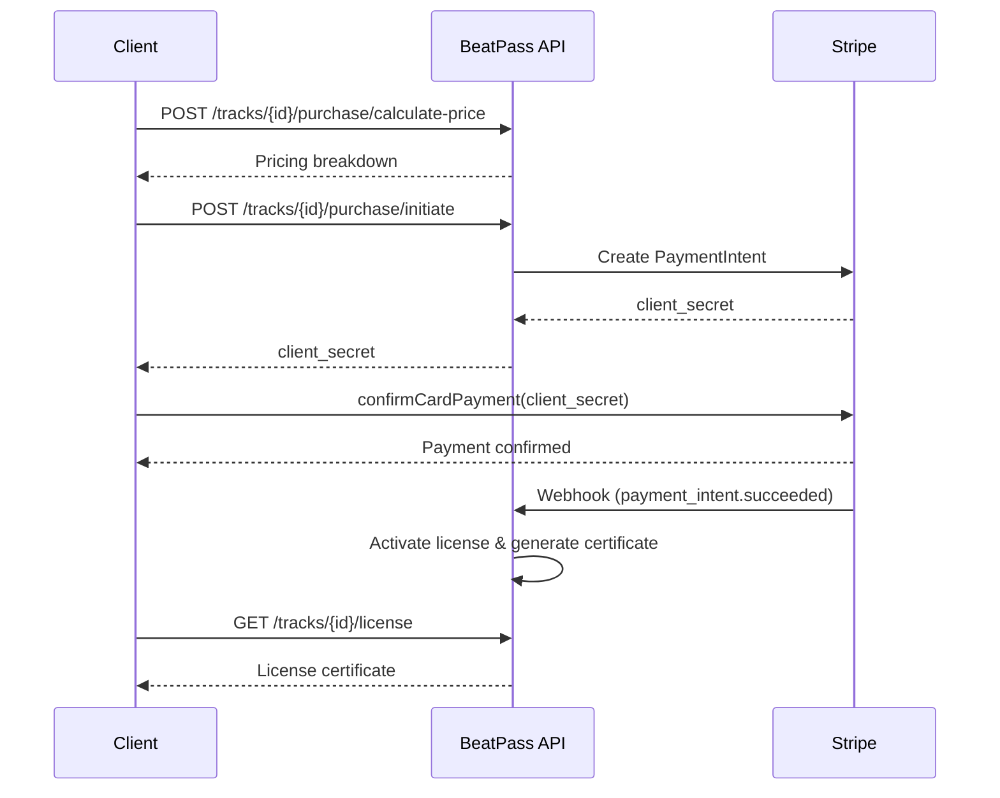

## Overview

The Commerce & Licensing API handles the complete purchase lifecycle - from pricing calculation through card payment to license certificate generation. It also covers exclusive license preset management and safe producer finance references for approved integrations.

<Info>
  **Base URL:** `https://open.beatpass.ca/api/v1`

  **Authentication:** All endpoints require a valid Bearer token unless noted otherwise.
</Info>

---

## Track Purchases

### Calculate Price

Get pricing details for a track before initiating purchase.

```http
POST /api/v1/tracks/{track}/purchase/calculate-price
```

<ParamField path="track" type="integer" required>
  Track ID to get pricing for.
</ParamField>

**Response:**

```json
{
  "status": "success",
  "data": {
    "base_price": 29.99,
    "platform_fee": 4.50,
    "total_amount": 29.99,
    "currency": "USD",
    "is_exclusive": true
  }
}
```

---

### Initiate Purchase

Start the purchase flow by creating a Stripe <Tooltip tip="A Stripe object that tracks a payment from creation to completion. The client_secret is used to confirm payment on the frontend.">PaymentIntent</Tooltip>.

```http
POST /api/v1/tracks/{track}/purchase/initiate
```

<ParamField path="track" type="integer" required>
  Track ID to purchase.
</ParamField>

**Response:**

```json
{
  "status": "success",
  "data": {
    "client_secret": "pi_xxx_secret_xxx",
    "purchase_id": 42,
    "pricing": {
      "base_price": 29.99,
      "platform_fee": 4.50,
      "total_amount": 29.99,
      "currency": "USD"
    }
  }
}
```

<Warning>
  Use the `client_secret` with Stripe.js on the frontend to complete payment confirmation. Do not store or log client secrets.
</Warning>

**Common Errors:**

| Error | Code | Cause |
|-------|------|-------|
| Track purchases not enabled | 403 | Feature disabled in config |
| Cannot purchase own track | 422 | Buyer is the track artist |
| Already purchased | 422 | User already owns license |
| Artist not set up for payments | 422 | Artist is not payout-ready |

---

### Check Purchase Status

Check whether the authenticated user has purchased a specific track.

```http
GET /api/v1/tracks/{track}/purchase/status
```

**Response:**

```json
{
  "status": "success",
  "data": {
    "has_purchased": true,
    "can_purchase": false,
    "reason": "already_purchased"
  }
}
```

---

### User Purchases

Get the authenticated user's purchase history.

```http
GET /api/v1/purchases
```

<ParamField query="per_page" type="integer">
  Results per page. Default: `15`.
</ParamField>

---

### Artist Sales

Get sales data for the authenticated artist, including payout and balance summary fields when available.

```http
GET /api/v1/artist/sales
```

**Response:**

```json
{
  "status": "success",
  "data": {
    "earnings": {
      "total_sales": 12,
      "total_revenue": 245.50,
      "total_revenue_formatted": "\$245.50 USD",
      "pending_payout": 89.00,
      "paid_out": 156.50,
      "currency": "USD"
    },
    "recent_purchases": [
      {
        "id": 1,
        "track_id": 42,
        "track_name": "Summer Vibes",
        "artist_amount": 25.49,
        "total_amount": 29.99,
        "platform_fee": 4.50,
        "status": "succeeded",
        "purchased_at": "2025-01-15 14:30:00"
      }
    ]
  }
}
```

---

## Purchase Flow

<Steps>
  <Step title="Calculate Price">
    Call `POST /tracks/{track}/purchase/calculate-price` to get current pricing.
  </Step>
  <Step title="Initiate Purchase">
    Call `POST /tracks/{track}/purchase/initiate` to create a Stripe PaymentIntent.
  </Step>
  <Step title="Confirm Payment">
    Use the returned `client_secret` with Stripe.js `confirmCardPayment()` on the frontend.
  </Step>
  <Step title="Webhook Confirmation">
    Stripe sends a `payment_intent.succeeded` webhook to BeatPass. The platform activates the license and generates a certificate.
  </Step>
  <Step title="Access License">
    The buyer can download the track and retrieve their license certificate.
  </Step>
</Steps>



---

## License Certificates

### Check License

Check if a license exists for a track.

```http
GET /api/v1/tracks/{track}/check-license
```

### Batch Check Licenses

Check licenses for multiple tracks at once.

```http
POST /api/v1/tracks/check-licenses-batch
```

### View License Certificate

Retrieve the license certificate data for a purchased track.

```http
GET /api/v1/tracks/{track}/license-certificate
```

<ParamField path="track" type="integer" required>
  Track ID to retrieve the license certificate for.
</ParamField>

### Download License PDF

Download the license certificate as a PDF document.

```http
GET /api/v1/tracks/{track}/download-license-pdf
```

### Verify License (Public)

Verify a license certificate by its UUID. This endpoint does not require authentication.

```http
POST /api/v1/verify-license/{uuid}
```

<ParamField path="uuid" type="string" required>
  License certificate UUID.
</ParamField>

### Revoke License

Revoke a previously issued license.

```http
POST /api/v1/licenses/{uuid}/revoke
```

### User Licenses

Get all license certificates for the authenticated user.

```http
GET /api/v1/user/licenses
```

---

## Exclusive License Presets

Manage reusable pricing presets — <Tooltip tip="A saved set of pricing and rights configurations that producers can reuse across multiple beats for exclusive sales.">exclusive license presets</Tooltip> — for exclusive license sales.

### List Presets

```http
GET /api/v1/exclusive-license-presets
```

### Get Default Config

Retrieve the default exclusive license configuration.

```http
GET /api/v1/exclusive-license-presets/default-config
```

### Get Preset

```http
GET /api/v1/exclusive-license-presets/{preset}
```

### Create Preset

```http
POST /api/v1/exclusive-license-presets
```

### Update Preset

```http
PUT /api/v1/exclusive-license-presets/{preset}
```

### Delete Preset

```http
DELETE /api/v1/exclusive-license-presets/{preset}
```

### Set Default Preset

```http
POST /api/v1/exclusive-license-presets/{preset}/set-default
```

---

## Artist Exclusive License Default

Manage the artist's default exclusive license configuration, auto-applied to new tracks.

### Get Default

```http
GET /api/v1/artist/exclusive-license-default
```

### Set Default

```http
POST /api/v1/artist/exclusive-license-default
```

---

## Coupon Validation

Validate a discount code during checkout. This is the only user-facing coupon endpoint — coupon creation and management require administrative access.

### Validate Coupon Code

Check if a coupon code is valid and calculate the discount amount.

```http
POST /api/v1/billing/coupons/validate
```

<ParamField body="code" type="string" required>
  Coupon code to validate.
</ParamField>
<ParamField body="product_id" type="integer">
  Product/plan ID the coupon will be applied to.
</ParamField>
<ParamField body="price_id" type="integer">
  Price ID the coupon will be applied to.
</ParamField>
<ParamField body="amount" type="number">
  Original amount (before discount) for calculating savings.
</ParamField>

**Success Response:**

```json
{
  "status": "success",
  "coupon": {
    "id": 1,
    "code": "SAVE20",
    "type": "percentage",
    "amount": 20
  },
  "discount_amount": 5.99,
  "final_amount": 23.99,
  "savings": 5.99,
  "valid": true
}
```

**Error Responses:**

| Error | Code | Cause |
|-------|------|-------|
| Invalid or expired coupon code | 422 | Code not found or expired |
| You cannot use this coupon | 422 | User-specific restriction |
| Cannot be applied to selected plan | 422 | Coupon not valid for this product |

---

## Producer Payout Setup

<Info>
  BEATPAY bank payout setup is an in-product Producer Finances workflow, not a public developer integration surface. Do not build integrations against undocumented payout setup routes.
</Info>

### Stripe Connect Status

Check the state of an authenticated artist's existing legacy Stripe Connect account.

```http
GET /api/v1/artist/stripe-connect/status
```

### Stripe Connect Onboarding Link

This compatibility endpoint remains available to existing internal consumers. Producer Finances does not offer new or resumed Stripe onboarding. New payout setup must use the BEATPAY workflow shown in the application.

```http
POST /api/v1/artist/stripe-connect/onboard
```

### View Legacy Stripe Finances

Get the artist's legacy Stripe Connect financial overview where available.

```http
GET /api/v1/artist/stripe-connect/finances
```

---

### Producer Finances Summary

Return local payout setup, currency-specific earnings totals in minor units, attention count, and calculation time for an artist managed by the authenticated user.

```http
GET /api/v1/artists/{artist}/finances/summary
```

The response keeps currencies separate and does not contact Stripe or Wise. `setup.providers.beatpay` describes BEATPAY availability and its current bank-recipient state. `setup.providers.legacyStripe` is present only for a legacy Stripe account that is still active or draining. The compatibility field `setup.canResumeStripe` remains `false` because new or resumed Stripe onboarding is not available.

### Producer Finance Activity

Return a filtered, paginated union of track sales and subscription earnings.

```http
GET /api/v1/artists/{artist}/finances/transactions?status=all&type=all&page=1&per_page=20
```

Supported status values are `all`, `waiting`, `sending`, `needs_attention`, `completed`, and `refunded`. Supported type values are `all`, `sales`, and `subscriptions`. The endpoint still accepts the legacy `filter` parameter for compatibility. The default and maximum page size is `20`.

The response includes `pagination.page`, `perPage`, `total`, `from`, `to`, `hasPrevious`, and `hasMore`. Status and type counts describe eligible earnings, so an unsuccessful checkout that never became an earning is not included.

Amounts use `amountMinor`, `minorUnitFactor`, and an ISO currency code. The response does not include buyer email addresses, bank details, Stripe objects, or Wise recipient identifiers.

### Legacy Stripe Provider Balance

Return only the available and pending Stripe Connect balances required by the Finances page.

```http
GET /api/v1/artists/{artist}/finances/provider-balance
```

Amounts use the currency-specific `minorUnitFactor`. This endpoint can use a short-lived cached result. It does not return charges, payouts, purchases, or lifetime provider history.

## Related Resources

<Columns cols={2}>
  <Card title="Webhooks" icon="link" href="/developers/webhooks">
    Payment event processing overview for purchase confirmation.
  </Card>
  <Card title="Error Catalog" icon="triangle-exclamation" href="/developers/error-catalog">
    Purchase and licensing error codes.
  </Card>
</Columns>
