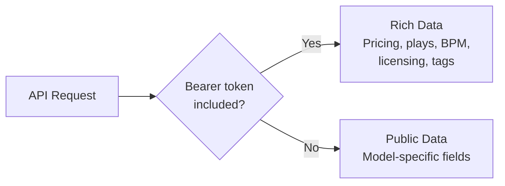

import ApiInviteOnly from "/snippets/warnings/api-invite-only.mdx";

The BeatPass API provides access to platform data for approved developer integrations and partnerships. All authenticated requests use <Tooltip tip="A secret credential sent in the Authorization header to authenticate API requests. Granted by the BeatPass team on a case-by-case basis." cta="Auth guide" href="/developers/auth">Bearer token</Tooltip> authentication.

<ApiInviteOnly />

## Quick Links

<Columns cols={3}>
  <Card title="Quickstart" icon="rocket" href="/developers/quickstart">
    Get up and running quickly
  </Card>
  <Card title="Authentication" icon="key" href="/developers/auth">
    Learn the auth flow
  </Card>
  <Card title="API Reference" icon="code" href="/developers/api-reference/overview">
    Explore all endpoints
  </Card>
</Columns>

---

## Integration Requests

If you're interested in integrating with BeatPass (partnerships, data licensing, embedded players), contact support to discuss options.

<Card title="Partnership Inquiries" icon="handshake" horizontal href="/help/contact-support">
  Contact support for integration discussions.
</Card>

---

## Base URL

All API requests use the base URL:

```
https://open.beatpass.ca/api/v1
```

---

## API Surface

The BeatPass API provides comprehensive functionality across the platform:

<Tabs>
  <Tab title="Content & Discovery">
    <Columns cols={2}>
      <Card title="Tracks" icon="record-vinyl">
        List, view, upload, update, delete tracks
      </Card>
      <Card title="Albums" icon="layer-group">
        Album management and metadata
      </Card>
      <Card title="Artists" icon="user">
        Artist profiles, followers, tracks
      </Card>
      <Card title="Playlists" icon="list">
        Create, manage, share playlists
      </Card>
      <Card title="Search" icon="magnifying-glass">
        Full-text search across content types
      </Card>
      <Card title="Genres" icon="tags">
        Genre listing and filtering
      </Card>
      <Card title="Lyrics" icon="align-left">
        Synced and plain lyrics management
      </Card>
      <Card title="Radio" icon="radio">
        Personalized music recommendations
      </Card>
    </Columns>
  </Tab>
  <Tab title="Commerce & Licensing">
    <Columns cols={2}>
      <Card title="Track Purchases" icon="cart-shopping">
        Per-track purchase and license flow
      </Card>
      <Card title="License Certificates" icon="file-contract">
        Generate, verify, revoke licenses
      </Card>
      <Card title="Exclusive Licenses" icon="lock">
        Preset management for exclusive sales
      </Card>
      <Card title="Subscription Payouts" icon="money-bill-transfer">
        Artist earnings from subscriptions
      </Card>
      <Card title="Producer payouts" icon="money-bill-transfer">
        Read-only payout summaries where documented; setup stays in **Finances**
      </Card>
      <Card title="Coupons" icon="ticket">
        Discount code management
      </Card>
    </Columns>
  </Tab>
  <Tab title="Producer Tools">
    <Columns cols={2}>
      <Card title="Producer Intelligence" icon="trophy">
        XP, achievements, leaderboards
      </Card>
      <Card title="Analytics" icon="chart-line">
        Track performance, engagement metrics
      </Card>
      <Card title="Contribution Pool" icon="coins">
        Earnings estimates, track breakdowns
      </Card>
      <Card title="Payout Analytics" icon="money-check-dollar">
        History, projections, trends
      </Card>
      <Card title="Audio Fingerprinting" icon="fingerprint">
        Duplicate detection, content ID
      </Card>
      <Card title="Audio Recon" icon="bullseye">
        Detected audio similarities on streaming platforms
      </Card>
      <Card title="Producer Access Requests" icon="user-check">
        Backstage submission status checks and conflict guidance
      </Card>
      <Card title="Cover Art" icon="image">
        Template-based cover art generation
      </Card>
      <Card title="Artist Credits" icon="id-badge">
        Professional portfolio credits
      </Card>
    </Columns>
  </Tab>
  <Tab title="Social & Collaboration">
    <Columns cols={2}>
      <Card title="Messaging" icon="comments">
        Direct messages with typing indicators
      </Card>
      <Card title="Beat Requests" icon="wave-square">
        Custom beat request marketplace
      </Card>
      <Card title="Following" icon="user-plus">
        User and artist follow system
      </Card>
      <Card title="Reposts" icon="retweet">
        Content sharing within platform
      </Card>
      <Card title="Collections" icon="layer-group">
        Curated content collections
      </Card>
      <Card title="User Library" icon="bookmark">
        Liked tracks, albums, and artists
      </Card>
    </Columns>
  </Tab>
</Tabs>

---

## Request Format

### HTTP Methods

<Columns cols={4}>
  <Card title="GET" icon="download">
    Retrieve data
  </Card>
  <Card title="POST" icon="plus">
    Create resources
  </Card>
  <Card title="PUT" icon="pen">
    Update resources
  </Card>
  <Card title="DELETE" icon="trash">
    Remove resources
  </Card>
</Columns>

### Required Headers

```http
Accept: application/json
Content-Type: application/json
```

<Info>
  Authenticated requests must include a valid Bearer token. See the [Authentication guide](/developers/auth) for details.
</Info>

---

## Response Format

### Success Response

Response envelopes vary by endpoint. Track listing returns `status` and `pagination`, while dashboard statistics return `success` and `data`. Dashboard fields such as `total_tracks` and `total_plays` are inside `data`. Use the response contract for the specific endpoint.

### Error Response

```json
{
  "message": "Error description",
  "errors": {
    "field": ["Validation error"]
  }
}
```

### Pagination

Pagination is endpoint-specific. `GET /tracks` wraps its page in `pagination` alongside `status: "success"`. It uses the following source-supported page-number forms; other endpoints can use different field names or cursor/offset pagination.

Length-aware pages include `total`, `last_page`, and numeric `next_page`/`prev_page`. Simple pages omit totals and last-page counts and instead include `next_page_url`/`prev_page_url`. The `paginate=simple` query parameter, or the runtime `simple_pagination_tables` setting, selects simple pagination. The deployed setting has not been verified here.

For track listing, `per_page` defaults to 15 and is capped at 500 in source. `from` and `to` are 1-based positions for the displayed items and are null on an empty page. A length-aware `last_page` is at least 1, including when `total` is 0. Retain the request's page size and filters when moving between pages.

Synthetic, nonfunctional documentation fixtures only. Names, identifiers, URLs and counts are invented, not copied from accounts or a live response. Numeric IDs can coincide with real records; never send these fixtures to a live API.

Length-aware example for a first page requested with `per_page=1`:

```json
{
  "status": "success",
  "pagination": {
    "current_page": 1,
    "data": [
      {
        "id": 900000001,
        "name": "Synthetic track fixture",
        "image": "https://example.com/synthetic-fixture.png",
        "created_at": "2026-01-01T00:00:00.000000Z",
        "updated_at": "2026-01-01T00:00:00.000000Z",
        "model_type": "track",
        "duration_text": "3:00",
        "views": 0,
        "plays": 0,
        "artists": [],
        "genres": []
      }
    ],
    "from": 1,
    "last_page": 3,
    "next_page": 2,
    "per_page": 1,
    "prev_page": null,
    "to": 1,
    "total": 3
  }
}
```

Simple example with one displayed item and another page available:

```json
{
  "status": "success",
  "pagination": {
    "current_page": 1,
    "data": [
      {
        "id": 900000001,
        "name": "Synthetic track fixture",
        "image": "https://example.com/synthetic-fixture.png",
        "created_at": "2026-01-01T00:00:00.000000Z",
        "updated_at": "2026-01-01T00:00:00.000000Z",
        "model_type": "track",
        "duration_text": "3:00",
        "views": 0,
        "plays": 0,
        "artists": [],
        "genres": []
      }
    ],
    "first_page_url": "https://api.example.com/api/v1/tracks?page=1",
    "from": 1,
    "next_page_url": "https://api.example.com/api/v1/tracks?page=2",
    "path": "https://api.example.com/api/v1/tracks",
    "per_page": 1,
    "prev_page_url": null,
    "to": 1
  }
}
```

Empty length-aware example:

```json
{
  "status": "success",
  "pagination": {
    "current_page": 1,
    "data": [],
    "from": null,
    "last_page": 1,
    "next_page": null,
    "per_page": 1,
    "prev_page": null,
    "to": null,
    "total": 0
  }
}
```

An empty simple page uses `data: []`, null `from`/`to`, and null `next_page_url`; it still omits `total` and `last_page`. Neither track paginator form has a `links` object.

---

## Authentication & Data Access

The BeatPass API uses a **<Tooltip tip="Public and token response fields vary by model and endpoint. Public Track data can include image, timestamps and loaded artist/genre relations.">two-tier access model</Tooltip>** for external consumers:

| Tier | Auth | Data |
|------|------|------|
| **Public** | None | Model-specific fields; Track includes image, created_at, duration_text and loaded artists/genres |
| **Token** | `Bearer {token}` | Rich (pricing, plays, BPM, licensing) |

<Warning>
  **Unauthenticated requests return minimal data.** You must have an approved Bearer token to access rich API responses. See [Authentication](/developers/auth) for details.
</Warning>



---

## Endpoint Categories

The API provides read access to public content (tracks, artists, albums, genres, search) and authenticated access to user-specific features (library, playlists, messaging, purchases, analytics).

Authentication and permissions vary by endpoint. Use producer and insights endpoints only for resources you are authorized to manage. A valid token alone does not establish ownership or authorize access to another producer's data.

See the [API Reference](/developers/api-reference/overview) for the full endpoint listing.

---

## Rate Limiting

The API enforces rate limits to ensure fair usage and platform stability. Exceeding limits returns a `429 Too Many Requests` response.

<Card title="Rate Limits Reference" icon="gauge-high" horizontal href="/developers/rate-limits">
  View rate limiting documentation and best practices.
</Card>

---

## Terms of Use

<Warning>
  API access is subject to the BeatPass Terms of Service. The following are strictly prohibited:
  
  - **Scraping or crawling** platform content
  - **Bypassing** rate limits or access controls
  - **Accessing** undocumented or internal endpoints
  - **Redistributing** API data without permission
  - **Automated bulk collection** of catalog data
  
  Violations result in immediate token revocation and account termination.
</Warning>

<Tip>
  Found a security issue? Report it responsibly to [**contact@beatpass.ca**](mailto:contact@beatpass.ca) — we appreciate responsible disclosure.
</Tip>

---

## Next Steps

<Columns cols={2}>
  <Card title="Authentication" icon="key" href="/developers/auth">
    Learn how API authentication works.
  </Card>
  <Card title="API Reference" icon="code" href="/developers/api-reference/overview">
    Complete endpoint reference.
  </Card>
</Columns>
